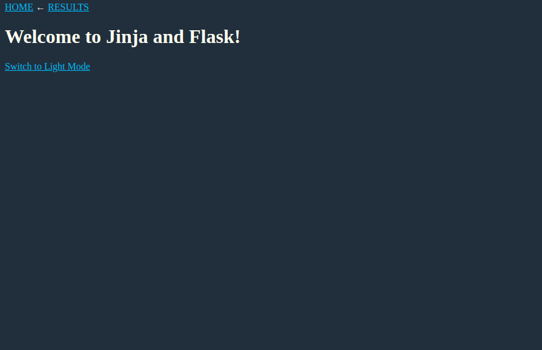
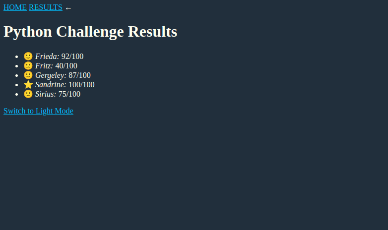

# jinja-flask-app
### Jinja templates + Flask tutorial

####
- Type: full-stack development
- Source: https://realpython.com/primer-on-jinja-templating/
- Date: July/2022

The simple project leveraging jinja templates in combination with flask app.

What was done within this project:
- Install the Jinja template engine
- Create your first Jinja template
- Render a Jinja template in Flask
- Use for loops and conditional statements with Jinja
- Nest Jinja templates
- Modify variables in Jinja with filters
- Use macros to add functionality to your front end

App screens:
- home page

- results page
- 
